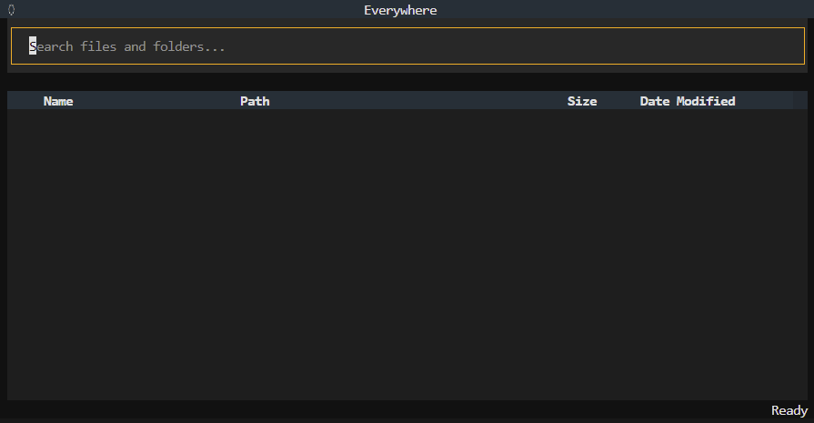

# Everywhere - Fast & local semantic search



## Why this exists

AI has gotten pretty good at understanding text. That's great. Agents and RAG pipelines are bulky, slow and complex. That's not so great. **Everywhere** is a simple terminal app that uses fast, on-device methods to index and let you search your entire filesystem in real time.

The project takes inspiration from [Everything](https://www.voidtools.com/support/everything/), the ultra-efficient filename search engine for Windows. While not quite as _blazingly fast_, Everywhere strives to be lightweight, effective and self-explanatory to use.

## Disclaimer

**Everywhere** is in the very early stages of development. It is not yet suitable for serious use. Expect bugs, performance issues, and breaking changes.

## Getting Started

Make sure [uv](https://docs.astral.sh/uv/getting-started/installation/) is installed on your system.

Try out the app without installing:

```bash
uvx --python 3.11 --from git+https://github.com/nopepper/everywhere.git everywhere
```

Installing and running:

```bash
uv tool install --python 3.11 git+https://github.com/nopepper/everywhere.git
everywhere
```

**Hint:** Run `uv tool upgrade everywhere` every now and then to get the latest version.

**Additional commands:**

- `everywhere --temp` will store all app data in a temporary directory and not persist across runs.
- `everywhere --reset` will delete all stored app data and reset the app to default settings.

## Usage Notes

- You can pick out the directories you want to index (click the circle in the top left corner, then select "Pick indexed directories...").
- Everywhere continuously monitors the filesystem for changes and updates the index accordingly.
- All configs and data are stored in `/home/{user}/.local/share/EverywhereApp` (Linux) and `%LOCALAPPDATA%\EverywhereApp` (Windows).
- Due to [Voyager](https://github.com/spotify/voyager) limitations, ARM CPUs are not supported on Windows.

## Development

You can clone the repository and run the app from source:

```bash
git clone https://github.com/nopepper/everywhere.git
cd everywhere
uv run everywhere
```

## Roadmap

- [ ] Add more search providers
  - [ ] Full-text indexing
  - [x] PDF search (text only)
  - [x] PDF search (OCR)
  - [x] Word document search (text only)
- [x] Improve performance
  - [x] Maximize throughput on CPU
  - [x] Vector database support
  - [x] Vector database saving/loading
  - [x] File watching with [watchdog](https://github.com/gorakhargosh/watchdog)
- [ ] Improve UX
  - [x] Indexing in background thread
  - [x] Indexing progress bar
  - [x] Limit search results to 1000 items
  - [x] Aggregate search results from multiple search providers
  - [x] Directory selector & watcher
  - [ ] Search provider settings
- [ ] Improve quality
  - [x] Normalize embeddings
  - [x] Chunking upgrades
  - [ ] Optional reranking
- [ ] Improve reliability
  - [ ] Add tests
  - [x] Add logging & events
- [ ] Documentation & OSS
  - [x] License
  - [x] Readme
    - [x] Installation
    - [x] Usage
    - [x] Roadmap
    - [x] License
  - [ ] Update docs
- [ ] Future
  - [ ] GPU support
  - [ ] Faster filesystem parsing
  - [ ] Remote search providers (GDrive, Notion)
  - [ ] Image search providers
  - [ ] Standalone installer
  - [ ] Soft operators
    - [ ] OR operator !or (additive)
    - [ ] AND operator !and (multiplicative)
    - [ ] Closures with `((` and `))`

## Contributing

Feel free to open an issue if you find a bug or have an idea for a new feature.

## License

This project is licensed under the MIT License. See the [LICENSE](./LICENSE) file for details.
