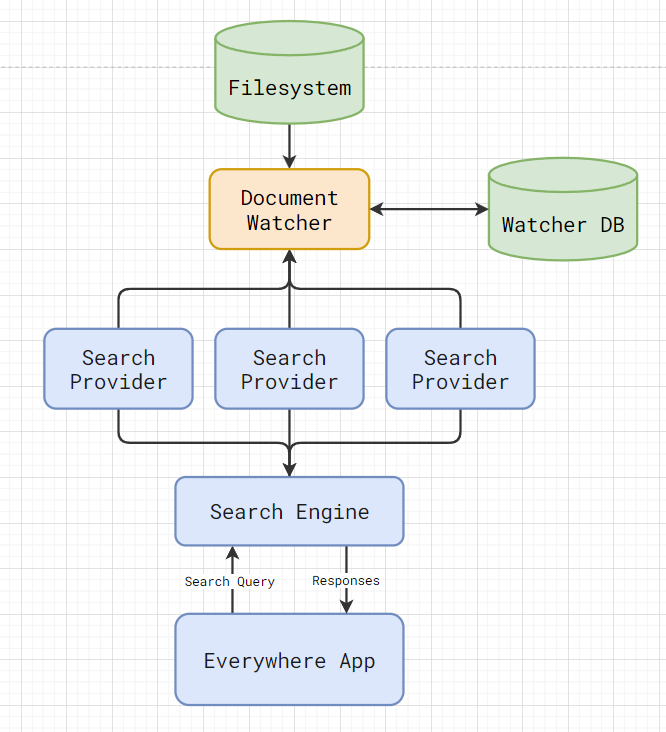

# Architecture

Two main loops:

## Watcher Loop

This loop is responsible for watching the filesystem for changes and indexing new content.

## User Loop

Main interaction between the user and the system. Users inputs are processed and the UI is updated in real time.

---

## Components Details

### Filesystem

For now, we focus on a user-defined directory. Generally speaking, a filesystem can be any structure of documents that can be parsed and indexed, such as local documents, but also Google Drive, Notion, etc.

### Document Watcher

Each filesystem has an associated document watcher. These watchers look for documents that have been added, modified or deleted, and update the database accordingly.

### Search Provider

Each search provider is responsible for keeping an up-to-date index of the content they're responsible for. Not all search providers can handle all content types. Search providers query the watcher for changes and update their index accordingly.

### Search Engine

The search engine is a mediator between the app and the search providers. It has the following responsibilities:

1. Preprocessing and passing the search query to relevant search providers

2. Aggregating the results from the search providers within latency constraints

3. Post-processing the results and returning a final list of results to the user
